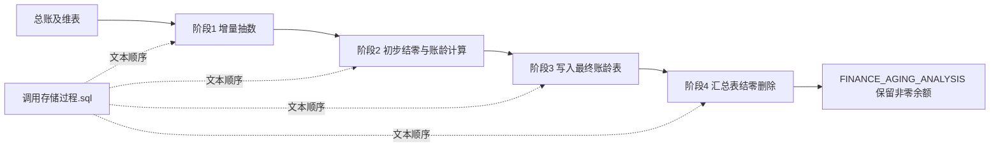
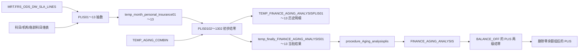
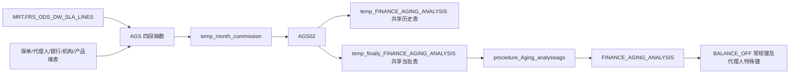
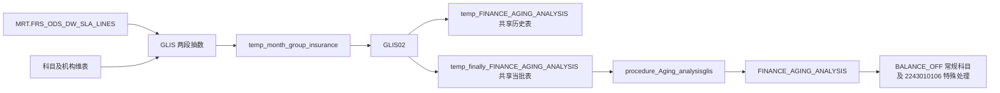

# 全局执行流程

## 维护人员快速入口

1. 先看本文确认四阶段顺序、参数接口和三条分支链路。
2. 查具体过程：进入 `03_逐过程分析/`。
3. 改金额、期间、账龄或结零规则前：先看 `05_财务账龄规则与口径.md`、`06_同类过程差异对照.md`、`07_风险与待确认问题清单.md`。
4. 评估新需求：复制 `08_需求变更影响分析模板.md`。
5. 上线或重跑前：执行 `09_回归测试与金额勾稽方案.md` 中的核对。

本套资料是静态代码分析结果。没有连接 Oracle 数据库，因此不能替代编译、执行计划、样例数据和财务总账核对。

## 1. 参数接口

【业务已确认】以下三种传值均正确；它们服务于不同阶段，不应仅因外观不同而改成同一种格式。

| 传值 | 使用位置 | 代码中的用途 | 结论类型 | 证据 |
|---|---|---|---|---|
| `YYYY-MM`，样例 `2025-04` | 阶段 1 全部分支；阶段 2 AGS | 阶段 1 直接匹配 `FRS_ODS_DW_SLA_LINES.PERIOD_NAME`；AGS 阶段 1 另转换为七位期间 | 【代码事实】【业务已确认】 | 调用脚本 `:3-19,:36`；PLIS01 `:48`；AGS 抽数 `:48,:114` |
| `YYYYMM`，样例 `202504` | 阶段 2 PLIS、GLIS | `TO_DATE(executemonth,'YYYYMM')` 求月末；同时写入 `AGING_MARKER` | 【代码事实】【业务已确认】 | 调用脚本 `:22-35`；PLIS0102 `:31,:112`；GLIS02 `:22,:76` |
| 七位期间，样例 `2025004` | 阶段 3、4 | 直接写入或匹配 `FINANCE_AGING_ANALYSIS.AGING_PERIOD` | 【代码事实】【业务已确认】 | 调用脚本 `:39-44`；PLIS 汇总 `:40`；`BALANCE_OFF:19` |

AGS 阶段 1 的明确转换公式为：

```text
YYYY-MM → SUBSTR(PERIOD_NAME,1,4) || LPAD(SUBSTR(PERIOD_NAME,6,2),3,'0')
2025-04 → 2025004
```

证据：`1.增量抽数/FIN_DATA_ANALYSIS.procedure_Aging_analysis_tempdataAGS.sql:48,151,253,358`。

## 2. 四阶段总流程



【代码事实】调用脚本列出的 34 个调用顺序是：15 个抽数过程 → 15 个初步结零过程 → GLIS/AGS/PLIS 三个最终汇总过程 → `BALANCE_OFF`。没有调度配置，不能据此证明生产环境不存在并行或人工分段执行。

## 3. PLIS 链路



- 阶段 1 按 `BRANCH_CODE LIKE '001001%'`～`'001013%'` 切分 13 张桥接表；PLIS13 还包含 `BRANCH_CODE='AAA'`。证据：13 个抽数过程各自过滤行；PLIS13 `:51`。
- 阶段 2 将当前桥接明细追加到 13 张历史表，对累计金额为零的组标记 `2`，按 1～5 档生成当批结果，再按 `TEMP_AGING_COMBIN` 配置的账龄档组合标记 `1`。证据：PLIS0102 `:41-153,:158-172,:177-295,:300-342`；其余 12 个为同构实现。
- 阶段 3 分 13 次读取当批结果，按科目、账龄档、机构、账户、保单等汇总并写最终表。证据：PLIS 汇总 `:11-890`。
- 阶段 4 先按“保单+科目”删除整体为零的组，再按“保单+机构+科目”建立第二组候选键。第二次实际删除遗漏科目匹配，详见风险 R-001。证据：`BALANCE_OFF:10-49`。

## 4. AGS 链路



- 阶段 1 用四个互补的来源/科目/类别分支抽取佣金数据，并把源期间转换为七位期间。证据：AGS 抽数 `:16-116,:119-218,:221-323,:326-429`。
- 阶段 2 对科目 `2202010206` 先做 AGS 全历史删除后重装；其他数据追加。账龄月使用“系统当前日期上月月末”与凭证日期的 `MONTHS_BETWEEN`，不是由参数推导。证据：AGS02 `:14,:20-21,:24-146,:222`。
- 阶段 3 先按科目、保单、地区、来源、渠道排除合计为零的组，再按更细维度汇总写最终表。证据：AGS 汇总 `:108-201`。
- 阶段 4 先按期间、科目、代理人、保单、业务场景结零，再对 `2202010207`、`2241010217` 按代理人结零。证据：`BALANCE_OFF:36-76`。

## 5. GLIS 链路



- 阶段 1 第一段读取 `GLI/GLIS` 且按配置科目，第二段读取 `FCS` 的两个固定科目；部分科目归并为 `207101*`、`207102*`。证据：GLIS 抽数 `:23-58,:76-111`。
- 阶段 2 先按“科目+保单”，再按“科目+保单+业务号”将历史零余额标为 `2`；科目 `2243010106` 排除在这两次预处理之外。证据：GLIS02 `:111-140`。
- 阶段 2 按与 PLIS 相同的 1～5 档账龄公式生成共享当批表；跨档组合结零代码整段被注释，未执行。证据：GLIS02 `:143-263,:265-313`。
- 阶段 3 对 `207101* / 207102*`、普通科目、`2203030101` 分三条规则汇总。证据：GLIS 汇总 `:14-76,:81-144,:147-208`。
- 阶段 4 普通科目按保单、科目、业务场景结零；`2243010106` 仅用账户段 `1301` 建候选，再按不含账户段的键删除。证据：`BALANCE_OFF:80-103`。

## 6. 阶段运行特性

| 阶段 | 输入 | 核心处理 | 输出/清理 | 提交点 | 失败残留 | 同月安全重跑 |
|---|---|---|---|---|---|---|
| 1 增量抽数 | 总账行及维表；`YYYY-MM` | 分支过滤、字段映射、借贷转有符号金额 | TRUNCATE 当月桥接表和对应当批表后重装 | 每过程末 1 次；TRUNCATE 另有隐式提交 | 可能只完成部分 TRUNCATE 或抽数；开始日志可被 DDL 提交 | 条件可刷新桥接表，但非原子、非并发安全；ID/日志会变化 |
| 2 PLIS | 13 张桥接表、历史表、档位组合；`YYYYMM` | 追加历史、累计结零、1～5 档、跨档结零 | 13 张历史表及 13 张当批表 | 循环内多次；PLIS01/03 另有额外提交 | 可能留下部分历史追加、部分标记和部分当批结果 | 否；未按 `AGING_MARKER` 清理同月历史追加 |
| 2 AGS/GLIS | 两张桥接表、共享历史表；两类参数 | AGS 非零过滤；GLIS 两级累计结零；生成共享当批表 | 共享历史/当批表 | AGS 末尾；GLIS 两次预处理后和末尾 | GLIS 可留下已标记但未生成当批结果的数据 | 否；除 AGS 特定科目外均会追加 |
| 3 最终汇总 | 13 张 PLIS 当批表和共享 AGS/GLIS 当批表；七位期间 | 分支汇总并追加最终表 | `FINANCE_AGING_ANALYSIS` | PLIS/AGS 末尾；GLIS 第一段后及末尾 | GLIS 可能只写完第一类科目 | 否；未见同期间预清理或 MERGE |
| 4 汇总表结零 | 最终表；七位期间 | 生成全局候选表并删除零余额组 | 删除当前期间零余额明细 | 过程末尾 | 无异常处理；成功提交前由调用事务语义决定 | 单独重跑通常只会继续删除，但候选表为全局表且不支持并发批次 |

## 7. 外部材料缺口

以下缺口不阻碍静态链路还原，但阻碍最终业务验收：

- 全部表、视图、序列、索引、约束和触发器 DDL。
- `SUBJECTENUMERATIONAGING` 与 `TEMP_AGING_COMBIN` 的配置数据和维护规则。
- 调度平台的作业依赖、并发策略、失败重试和事务边界。
- 币种字段/单币种保证、金额精度与结零容差口径。
- 样例期间数据、来源系统对账数、总账余额和历史正确结果。
- Oracle 版本、`NLS_DATE_FORMAT`、会话 NLS 设置和执行计划。
