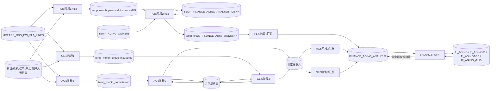

# 表级与关键字段级数据血缘

## 1. 阅读约定

- 【代码事实】本血缘只描述所提供 35 个 SQL 文件中可见的静态读写关系；对象 DDL、触发器、同义词、调度配置和数据样本未提供。
- 【代码事实】`NN` 代表 PLIS 分支 `01`～`13`；“共享历史表”指 `TEMP_FINANCE_AGING_ANALYSIS`，“共享当批表”指 `temp_finally_FINANCE_Aging_analysis`。
- 【待业务确认】未带 schema 的表是否都解析到 `FIN_DATA_ANALYSIS`，需用实际同义词和当前 schema 验证。

## 2. 表级主链路

【代码事实】图中 PLIS 为 13 套编号表；AGS 与 GLIS 共用历史/当批表，但通过 `JE_SOURCE` 在主要查询中区分。证据：PLIS0102 `:41,:177`；AGS02 `:24,:167-168`；GLIS02 `:29,:143`。

## 3. 表级读写清单

| 分类 | 数据层 | 主要对象 | 写入过程 | 读取过程 | 关键行为与证据 |
|---|---|---|---|---|---|
| 【代码事实】 | 源事实 | `MRT.FRS_ODS_DW_SLA_LINES` | 外部 | 阶段1 PLIS/AGS/GLIS | PLIS01 `:26-53`；AGS `:46-429`；GLIS `:23-111` |
| 【代码事实】 | 配置/维表 | `SUBJECTENUMERATIONAGING`、`FRS_DIM_COA_AC`、`FRS_DIM_COA_COAGING`、`FRS_DIM_COA_CO` 等 | 外部 | 抽取与最终汇总 | 科目筛选、名称、机构映射；PLIS01 `:28-50`；PLIS汇总 `:15-21` |
| 【代码事实】 | PLIS 月度层 | `temp_month_personal_insurance01`～`13` | 阶段1 PLISNN | 阶段2 PLISNN02 | 每次先 TRUNCATE 后重装；PLIS01 `:7,:11`；PLIS0102 `:114-128` |
| 【代码事实】 | PLIS 历史层 | `TEMP_FINANCE_AGING_ANALYSISPLIS01`～`13` | 阶段2 PLISNN02 | 同一过程递归读/更新 | 追加历史、标记累计/跨档结零；PLIS0102 `:41-172,:261-340` |
| 【代码事实】 | PLIS 当批层 | `temp_finally_FINANCE_Aging_analysis01`～`13` | 阶段2 PLISNN02 | 阶段3 PLIS | 阶段1先清空，阶段2写入，阶段3汇总；PLIS01 `:8`；PLIS0102 `:177`；PLIS汇总 `:11-890` |
| 【代码事实】 | AGS 月度层 | `temp_month_commission` | 阶段1 AGS | 阶段2 AGS02 | 四段抽取；AGS `:11,:16-429`；AGS02 `:24-146` |
| 【代码事实】 | GLIS 月度层 | `temp_month_group_insurance` | 阶段1 GLIS | 阶段2 GLIS02 | 两段抽取；GLIS `:5,:10-111`；GLIS02 `:29-108` |
| 【代码事实】 | 共享历史层 | `TEMP_FINANCE_AGING_ANALYSIS` | AGS02、GLIS02 | AGS02、GLIS02 | 两来源共享；AGS02 还删除特殊科目全历史；AGS02 `:20-21` |
| 【代码事实】 | 共享当批层 | `temp_finally_FINANCE_Aging_analysis` | AGS02、GLIS02 | AGS/GLIS 汇总 | 阶段1 AGS 与 GLIS 都会 TRUNCATE 同表；AGS `:12`，GLIS `:6` |
| 【代码事实】 | 最终层 | `FINANCE_AGING_ANALYSIS` | PLIS/AGS/GLIS 汇总 | BALANCE_OFF | 汇总过程仅追加；阶段4按候选物理删除；PLIS汇总 `:11-890`；BALANCE `:44-103` |
| 【代码事实】 | 结零候选层 | `FI_AGING*` | BALANCE_OFF | BALANCE_OFF | 每次全表清空后写候选并 EXISTS 删除；BALANCE `:4-103` |
| 【代码事实】 | 配置层 | `TEMP_AGING_COMBIN` | 外部 | PLISNN02 | 指定需要联合结零的账龄档组合；PLIS0102 `:13-14,:300-337` |
| 【代码事实】 | 日志层 | `course_method_log` | 除阶段1 GLIS外的多数过程 | 本代码集未读取 | 用序列写 START/END；日志状态和方法名存在不一致 |

## 4. 关键字段级血缘

| 分类 | 业务概念 | 源字段/规则 | 中间传递 | 最终字段或用途 | 证据与断点 |
|---|---|---|---|---|---|
| 【代码事实】 | 执行期间 | 调用参数：阶段1 `YYYY-MM`；PLIS/GLIS阶段2 `YYYYMM`；阶段3/4 七位期 | PLIS历史 `AGING_MARKER=YYYYMM`；AGS阶段1计算七位期 | `FINANCE_AGING_ANALYSIS.AGING_PERIOD=executemonth` | 调用脚本 `:3-44`；AGS阶段1 `:48`；PLIS汇总 `:22` |
| 【代码事实】 | 会计期间 | `FRS_ODS_DW_SLA_LINES.PERIOD_NAME=阶段1参数` | 阶段1目标显式列未包含 `PERIOD_NAME`；阶段2却读取它 | 用于阶段2非零分组/连接 | PLIS01 `:11-36,:45`；PLIS0102 `:84,:118-144`；为显式字段断点 |
| 【代码事实】 | 金额 | `NVL(ENTERED_DR,-ENTERED_CR)` | 月度明细 → 历史 → 当批，结零使用 `SUM(amount)` | 最终表 `amount=SUM(amount)` | PLIS01 `:25`；PLIS0102 `:141,:284`；PLIS汇总 `:25,:72` |
| 【合理推断】 | 借贷方向 | 借方非 NULL 时忽略贷方，即使借方为 0 | `amountflag` 以金额正负映射 D/C | 最终主要保留净金额 | 若源行可能同时有借贷值，结果不等于 `NVL(DR,0)-NVL(CR,0)`；需数据验证 |
| 【代码事实】 | 币种 | 提供的 SQL 中未检索到币种字段或币种过滤 | 所有零余额 SUM 均不含币种 | 可能跨币种汇总/删除 | 静态全文件检索结果；DDL/数据未提供 |
| 【代码事实】 | 保单/业务号 | `POLICY_NO`；`BUSINESS_NO=NVL(源业务号,保单号)` | 多级结零键选择性包含保单/业务号 | 最终按分支选择保留、MAX 或字面 `'null'` | PLIS01 `:36`；GLIS02 `:111-140`；GLIS汇总 `:147-208` |
| 【代码事实】 | 科目 | `SEGMENT3`，名称来自 `FRS_DIM_COA_AC`；GLIS 有 `207101*/207102*` 归一 | 历史/当批的 `SUBJECT_ID/NAME` | 最终 `SUBJECT_ID/NAME`，BALANCE_OFF 参与部分候选/删除键 | PLIS01 `:27-28`；GLIS阶段1 `:13-16,:66-69`；BALANCE `:10-49` |
| 【代码事实】 | 账户段 | `SEGMENT4` 按来源/科目保留、归一或置空 | PLIS 历史 `ACCOUNT_SEGMENT`；AGS02 插历史时未写该列 | 最终汇总粒度及 GLIS 特殊删除相关 | PLIS01 `:29-34`；AGS02 `:24-146,:215`；BALANCE `:89-96` |
| 【代码事实】 | 机构 | `SEGMENT1` 与机构维表映射为 `BRANCH_CODE`；PLIS02～13含 `100001→001`，PLIS13含 `AAA` | 历史使用 `district_id` 与 `BRANCH_CODE` | 最终机构前9位；PLIS空地区有回退 | PLIS02 `:34-45`；PLIS13 `:35-51`；PLIS汇总 `:15-21` |
| 【代码事实】 | 账龄基准日 | PLIS/GLIS阶段2：执行月月末；AGS02：系统上月末 | `MONTHS_BETWEEN(月末,DEFAULT_EFFECTIVE_DATE)` | PLIS/GLIS写 1～5 档，AGS写连续月份值 | PLIS0102 `:31,:231-236`；GLIS02 `:22,:198-203`；AGS02 `:14,:221-222` |
| 【代码事实】 | 结零状态 | 新历史/当批行写 `ZERO_CLOSING_MARKER=0` | PLIS预结零写2，跨档结零写1；GLIS预结零写2；AGS预处理注释 | 标记0的数据继续参与展示/计算 | PLIS0102 `:113,:159-168,:302-337`；GLIS02 `:111-140` |
| 【代码事实】 | 产品/代理/渠道 | AGS阶段1通过多维表富化；PLIS阶段1显式列未写大部分同名字段 | AGS02/PLISNN02读取并传递 | AGS最终粒度含代理、产品、渠道/分销 | AGS阶段1 `:16-429`；PLIS0102 `:80-110`；AGS汇总 `:108-200` |

### 4.1 标准字段血缘表

| 源表 | 源字段 | 转换/聚合 | 过滤/连接条件 | 目标表 | 目标字段 | 过程 | 结论类型 | 证据 |
|---|---|---|---|---|---|---|---|---|
| `MRT.FRS_ODS_DW_SLA_LINES` | `PERIOD_NAME` | 无，直接过滤 | `PERIOD_NAME=executemonth` | 月度中间表 | 未在PLIS/GLIS显式列清单写入 | 阶段1 PLIS/GLIS | 【代码事实】 | PLIS01 `:11-40,:48`；GLIS `:10-22,:52` |
| 调用参数 | `executemonth` | AGS：年+三位月份 | 源期间等于参数 | `temp_month_commission` | `PERIOD_NAME` | AGS阶段1 | 【代码事实】 | AGS `:48,:151,:253,:358` |
| `FRS_ODS_DW_SLA_LINES` | `ENTERED_DR/ENTERED_CR` | `NVL(ENTERED_DR,-ENTERED_CR)` | 各分支源/科目/机构条件 | 三类月度表 | `amount` | 全部阶段1 | 【代码事实】 | PLIS01 `:36`；AGS `:50`；GLIS `:27` |
| `FRS_ODS_DW_SLA_LINES` | `POLICY_NO/BUSINESS_NO` | `NVL(BUSINESS_NO,POLICY_NO)` | 源过滤 | 三类月度表 | `POLICY_NO/BUSINESS_NO` | 阶段1 | 【代码事实】 | PLIS01 `:28,:40`；GLIS `:22` |
| `FRS_ODS_DW_SLA_LINES` | `SEGMENT3` | 科目名称标量查询；GLIS部分科目归一 | 配置/固定科目集合 | 月度表 | `SEGMENT3/SEGMENT3name` | 阶段1 | 【代码事实】 | PLIS01 `:30-31,:52`；GLIS `:13-16,:53-56` |
| `FRS_ODS_DW_SLA_LINES` | `SEGMENT4` | PLIS按科目保留/归一/置空 | 指定科目/账户值 | `temp_month_personal_insuranceNN` | `SEGMENT4` | PLIS阶段1 | 【代码事实】 | PLIS01 `:32-34` |
| `FRS_ODS_DW_SLA_LINES`+机构维表 | `SEGMENT1/BRANCH_CODE` | 机构映射、取前9位 | `0010NN%`；部分分支含100001/AAA | PLIS月度表 | `SEGMENT1/BRANCH_CODE` | PLIS阶段1 | 【代码事实】 | PLIS02 `:34,:45`；PLIS13 `:35,:51` |
| `temp_month_personal_insuranceNN` | 多维键、`amount` | 分组 `HAVING SUM(amount)<>0` 后回连明细 | NULL字符串安全等值；日期直接等值 | `TEMP_FINANCE_AGING_ANALYSISPLISNN` | 历史明细、`AGING_MARKER`、标记0 | PLISNN02 | 【代码事实】 | PLIS0102 `:41-153` |
| PLIS历史表 | `DEFAULT_EFFECTIVE_DATE` | `MONTHS_BETWEEN` 后按3/12/36/60分五档 | 历史标记0且非零组 | PLIS当批表 | `AGING_MONTH` | PLISNN02 | 【代码事实】 | PLIS0102 `:231-295` |
| GLIS历史表 | `DEFAULT_EFFECTIVE_DATE` | 同PLIS五档 | 来源/标记及非零组 | 共享当批表 | `AGING_MONTH` | GLIS02 | 【代码事实】 | GLIS02 `:198-263` |
| AGS历史表 | `DEFAULT_EFFECTIVE_DATE` | `MONTHS_BETWEEN(系统上月末,日期)` | 来源AGS及细粒度非零组 | 共享当批表 | `AGING_MONTH` | AGS02 | 【代码事实】 | AGS02 `:14,:221-296` |
| PLIS/共享当批表 | 业务维度、`amount` | `SUM(amount)`；PLIS日期MIN、业务场景MAX | 来源/标记/特殊科目规则 | `FINANCE_AGING_ANALYSIS` | 最终科目、金额、日期、账龄、机构、保单等 | 阶段3三个汇总 | 【代码事实】 | PLIS汇总 `:11-75`；AGS `:108-200`；GLIS `:14-208` |
| `FINANCE_AGING_ANALYSIS` | 分支特定键、`amount` | `GROUP BY ... HAVING SUM(amount)=0` | 指定七位期间和来源 | `FI_AGING*` | 零余额候选键 | `BALANCE_OFF` | 【代码事实】 | BALANCE `:10-42,:63-96` |
| `FI_AGING*`+最终表 | 候选键 | `EXISTS` 匹配后物理DELETE | 指定七位期间和来源 | `FINANCE_AGING_ANALYSIS` | 删除行 | `BALANCE_OFF` | 【代码事实】 | BALANCE `:44-60,:71-76,:99-103` |
| 未见 | 币种字段 | 未见换算或分组 | 未见币种条件 | 全链路 | 未见币种目标字段 | 全部过程 | 【代码事实】 | 35个SQL静态检索；DDL待补 |

## 5. 显式字段断点

| 分类 | 断点 | 直接影响 | 证据 | 结论 |
|---|---|---|---|---|
| 【代码事实】 | PLIS阶段1显式 INSERT 仅写 `id/POLICY_NO/JE_SOURCE/SEGMENT3/SEGMENT3name/SEGMENT4/DEFAULT_EFFECTIVE_DATE/amount/BRANCH_CODE/SEGMENT1/LINE_DESCIPTION/BUSINESS_NO` | PLIS阶段2读取更多账簿、短名、期间、产品、日期、人员/分销字段 | PLIS01 `:11-36` 对比 PLIS0102 `:80-111` | 【待业务确认】DDL 默认值/触发器是否补齐；否则为 NULL |
| 【代码事实】 | GLIS阶段1显式列同样未覆盖阶段2多个读取字段 | 初始 HAVING/连接中的短名、期间、产品、新产品码等可能为 NULL | GLIS阶段1 `:10-22,:63-75` 对比 GLIS02 `:54-85` | 【待业务确认】DDL/触发器 |
| 【代码事实】 | AGS历史 INSERT 未含 `ACCOUNT_SEGMENT`，但后续读取 | AGS当批/最终的账户维度可能为空 | AGS02 `:24-146,:215` | 【待业务确认】列默认值或触发器 |
| 【代码事实】 | AGS阶段1没有显式写 `LEDGER_ID/SHORT_NAME/PRODUCT_NO`，阶段2读取 | AGS这些维度可能为空 | AGS阶段1 `:16-45`；AGS02 `:52-54` | 【待业务确认】DDL/触发器 |

## 6. 血缘完整性结论

- 【代码事实】从源事实表到最终表以及阶段4删除的主链路，在所给过程内可闭合；外部断点主要是 DDL、维表数据约束、调度和币种口径。
- 【合理推断】字段断点不等于运行时必然为 NULL，因为表默认值或触发器可能补值；在拿到 DDL 前，应按高优先级验证项处理，不应直接认定为已发生的数据错误。
- 【合理推断】AGS 与 GLIS 共用中间表且两个阶段1过程都会 TRUNCATE 共享当批表；当前串行调用次序可工作，但任何并行化、局部重跑或调度拆分都可能改变结果。

## 7. 全量活动对象覆盖附录

【代码事实】以下清单来自基线35个SQL去除行注释/块注释后的 `FROM/JOIN/INSERT INTO/UPDATE/DELETE FROM/TRUNCATE TABLE` 提取，共62个唯一表/视图式引用；最终复核新增的34个镜像SQL未增加唯一对象。

| 对象类别 | 数量 | 全量对象名 | 读写角色 |
|---|---:|---|---|
| 源事实 | 1 | `MRT.FRS_ODS_DW_SLA_LINES` | 阶段1读取 |
| 外部维表 | 9 | `FRS_DIM_COA_COAGING`、`MRT.FRS_DIM_COA_AC`、`MRT.FRS_DIM_COA_CO`、`MRT.FRS_DIM_COA_PD`、`MRT.FRS_ODS_D_AGENCY`、`MRT.FRS_ODS_D_AGENT`、`MRT.FRS_ODS_D_BANK`、`MRT.FRS_ODS_D_BROKER`、`MRT.FRS_ODS_POLICY` | 阶段1富化/过滤，阶段3机构名称 |
| 配置表 | 2 | `SUBJECTENUMERATIONAGING`、`TEMP_AGING_COMBIN` | 科目范围、跨档组合读取 |
| Oracle工具表 | 1 | `DUAL` | 日期序列与月末计算读取 |
| 日志表 | 1 | `COURSE_METHOD_LOG` | 多数过程写入 |
| 最终表 | 1 | `FINANCE_AGING_ANALYSIS` | 阶段3写、阶段4读/删 |
| 阶段4候选表 | 4 | `FI_AGING`、`FI_AGING01`、`FI_AGINGAGS`、`FI_AGING_GLIS` | 清空、写候选、读匹配 |
| PLIS月度表 | 13 | `TEMP_MONTH_PERSONAL_INSURANCE01`～`13` | 阶段1写、阶段2读 |
| PLIS历史表 | 13 | `TEMP_FINANCE_AGING_ANALYSISPLIS01`～`13` | 阶段2读/写/更新 |
| PLIS当批表 | 13 | `TEMP_FINALLY_FINANCE_AGING_ANALYSIS01`～`13` | 阶段1清空、阶段2写/更新、阶段3读 |
| AGS/GLIS月度表 | 2 | `TEMP_MONTH_COMMISSION`、`TEMP_MONTH_GROUP_INSURANCE` | 阶段1写、阶段2读 |
| 共享历史表 | 1 | `TEMP_FINANCE_AGING_ANALYSIS` | AGS02/GLIS02读写更新 |
| 共享当批表 | 1 | `TEMP_FINALLY_FINANCE_AGING_ANALYSIS` | 阶段1清空、阶段2写、阶段3读 |
| **合计** | **62** | — | — |

【代码事实】活动 SQL 还引用34个唯一序列：`SEQUENCE_COURSE_METHOD_LOG`、`SEQUENCE_FINANCE_AGING_ANALYSIS`、`SEQUENCE_FI_AGING`、`SEQUENCE_FI_AGINGAGS`、`SEQUENCE_TEMP_FINALLY_FINANCE_AGING_ANALYSIS`、`SEQUENCE_TEMP_FINALLY_FINANCE_AGING_ANALYSIS01`、`SEQUENCE_TEMP_FINANCE_AGING_ANALYSIS`、`SEQUENCE_TEMP_FINANCE_AGING_ANALYSISPLIS02`～`13`、`SEQUENCE_TEMP_MONTH_COMMISSION`、`SEQUENCE_TEMP_MONTH_GROUP_INSURANCE`、`SEQUENCE_TEMP_MONTH_PERSONAL_INSURANCE01`～`13`。

- 【代码事实】全部 PLIS 02 过程写各自编号当批表时均使用 `SEQUENCE_TEMP_FINALLY_FINANCE_AGING_ANALYSIS01`，不是对应编号序列。证据：PLIS0102 `:217`、PLIS0202对应当批INSERT、PLIS1302对应当批INSERT。
- 【待业务确认】这些当批表是否有意共享全局序列；若各表要求独立序列，需按13个过程逐一修正并回归。
